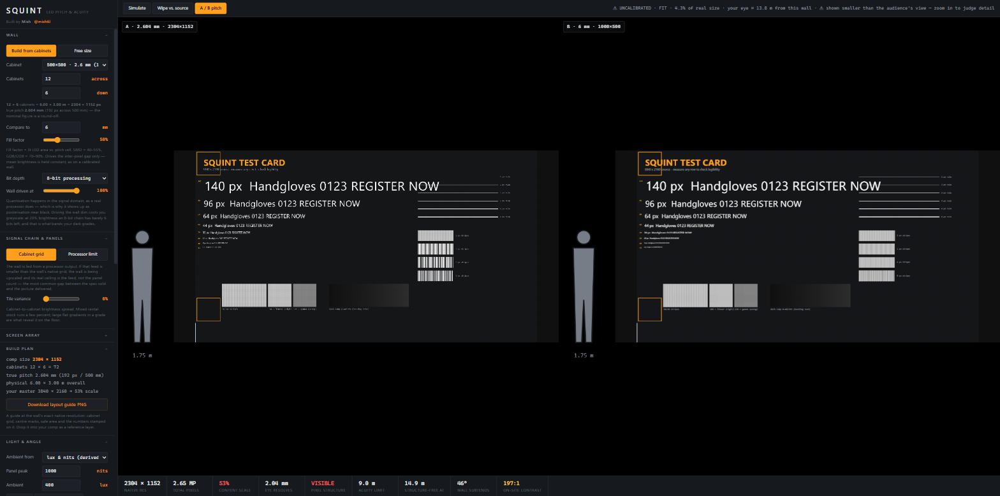
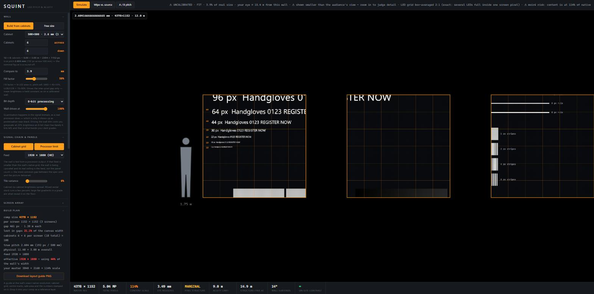

# SQUINT

**An LED wall simulator that takes your actual content.**

Every pixel-pitch visualiser I could find is parametric — you move a pitch slider
and it renders a stock photo. None of them ingest the thing you're actually going
to play, which is where the real answer lives:

> A 12 m wall at 3.9 mm is **3077 px wide**. Your 4K master loses 20% of its
> detail before pixel pitch does anything at all. That is usually what kills a
> design, not the pitch.

SQUINT is one self-contained HTML file. Drop in an image or a video, describe the
wall, and it shows you what the audience will actually see — computed in linear
light on the GPU.

---

## Run it

**Download `squint.html` and double-click it.** No install, no dependencies, no
build step, no network. Nothing you load ever leaves your machine — it's one
readable file, so you can verify that yourself.

Needs WebGL2 with float render targets. If they're missing it shows a refusal
card instead of rendering (see *Design commitments*).

**Calibrate once:** Monitor calibration → drag until the box matches a real
credit card held against your screen. Until you do, the 1:1 and eye-match modes
are guesses and the top bar says UNCALIBRATED.

## What it models

| | |
|---|---|
| **Native grid** | Content resampled to the wall's true LED grid by an exact box filter |
| **Cabinets** | Walls are built from real tiles, and the pitch is derived from the tile — a 500 mm cabinet at "2.6 mm" carries 192 px, so the true pitch is 2.604 mm and a 12×6 wall is exactly 2304×1152 |
| **Processor feed** | A 2304-wide wall fed 1920×1080 is a 1920-wide wall that happens to contain more LEDs. Content is genuinely resampled through the feed's grid |
| **Bit depth / drive** | Quantisation in the signal domain. An 8-bit chain at 20% drive collapses a 40-level dark ramp to 9 — this is why dark grades band on real walls |
| **Pixel structure** | Analytic sub-pixel fill coverage; fill factor costs structure, never brightness, because a real wall is calibrated to its rated nits whatever the fill |
| **Ambient light** | Reflected luminance derived from lux, face reflectance and panel nits, with an on-site contrast readout |
| **Visual acuity** | 1-arcminute limit as a separable Gaussian in linear light, minus what your own eye already does to your monitor |
| **Screen arrays** | One canvas across several screens, with the gaps modelled as what they are — content mapped into a gap is not shown at all |

*Three screens at 1.2 m spacing. The headline loses its middle in the gap; the
build plan reports 21% of the canvas lost to the voids.*

## What it's for

- **Judging your own render** — wipe against an ideal wall; measure whether a
  cap-height letter will actually read at the viewing distance.
- **Speccing a wall** — A/B two pitches, and export a sheet that states its own
  viewing contract.
- **Pre-production** — the exact comp size, plus a layout guide PNG at native
  resolution with cabinet grid, centre marks and safe area.

## Two numbers worth knowing

**Acuity limit = 3.44 × pitch** — where the pitch equals the eye's 1-arcminute
resolution limit. **Structure-free ≈ 5.7 × pitch** — further out, because a
repeating grid stays detectable past the limit for a single isolated feature.
SQUINT shows both, separately labelled. Quote the first to sound like the
textbook; trust the second.

## The export carries a viewing contract

A pitch simulation is only true at one ratio of displayed size to viewing
distance. A 12 m wall shown as a 25 cm image on a laptop is optically the same as
standing 50 m back, where every pitch looks flawless. So the exported PNG states
the rule on its caption strip — *angularly true only when viewed from N × its
displayed width* — and bakes the audience's acuity in absolutely, because the
recipient's screen size and distance are unknown.

## Design commitments

- **No fallback renderer.** Two render paths would mean two different answers
  under one name. Missing WebGL2 gets a refusal card, deliberately.
- **The scale figure is chrome, not content.** A flat 1.75 m silhouette at the
  wall plane, drawn after the simulation, never through it. It never moves to
  stay in frame — a reference that follows the crop is a scale lie.
- **It states its limits.** The known-simplifications list in
  [README.txt](README.txt) is part of the tool, and it only shrinks with
  receipts.

## Is it right?

`SQUINT.selftest()` runs at boot and asserts, through the real pipeline, that a
50/50 black-and-white field fuses to **sRGB 188** (linear 0.5). Gamma-space
compositing lands on 128 — an earlier canvas-2D build of this tool read 131,
which is exactly the kind of confidently-wrong answer the rewrite exists to
remove. The bundled test card carries that patch with 188 and 128 reference
blocks beside it, so you can check the claim by eye in five seconds.

It's also been through two rounds of external code review and one adversarial
audit of the *model* rather than the code. Those write-ups, including the
verdict before the fixes ("not fit for client-facing pitch decisions") and every
finding with its status, are in [`reviews/`](reviews/).

## Not modelled

Contrast sensitivity (acuity is measured at maximum contrast, so the legibility
verdict is mildly optimistic for low-contrast content); camera artifacts —
refresh, scan banding, sensor moiré; geometric foreshortening off-axis
(brightness only); motion acuity (static errs safe); HDR; curved walls.

## Files

| | |
|---|---|
| `squint.html` | the tool — this is the whole thing |
| `README.txt` | the full manual, including the complete limitations list |
| `testcard.png` | 3840×2160 test card: legibility ladder, hairlines, stripe bursts, gamma-fusion patch with references, dark ramp |
| `make-testcard.ps1` | regenerates it |
| `reviews/` | the reviews that shaped the tool |

## Licence

MIT — see [LICENSE](LICENSE).

Built by Mish · [@mish6l](https://instagram.com/mish6l)

*If you work with event LED and this gets something wrong, I want to know.
Real failure cases are worth more than feature requests.*
